<p align="center">
  
</p>
<h1 align="center">Mojocarrot on Desk</h1>
<p align="center">
  <a href="README.zh-CN.md">中文版</a>
</p>
<p align="center">
  <a href="https://github.com/Puki-li/mojocarrot-on-desk-improved/actions/workflows/test.yml"></a>
  
</p>

A desktop pet that reacts to your AI coding agent sessions in real-time. This repository maintains a Mojocarrot-themed derivative of the public project [rullerzhou-afk/clawd-on-desk](https://github.com/rullerzhou-afk/clawd-on-desk), adapted into **Mojocarrot on Desk** for WMLS with reworked scene choreography, multi-agent activity tracking, and Codex-focused tooling.

> Supports Windows 11, macOS, and Ubuntu/Linux. Requires Node.js. Works with **Claude Code**, **Codex CLI**, **Copilot CLI**, **Gemini CLI**, and **Cursor Agent**.

## Features

### What's New in v1.0.2
- **Correct agent attribution** — standalone or mirrored hooks no longer create Claude Code, Gemini, Cursor, or Copilot activity for a different tool
- **Stable Codex quota** — the main weekly pool is isolated from model-specific limits, and slow archive scans cannot overwrite newer live usage
- **Historical task recovery** — resumed Codex tasks remain discoverable in their original date directories, including long-running turns that were already quiet when Mojocarrot started
- **Reliable long-turn completion** — liveness heartbeats no longer outrank slightly delayed completion records; local and remote monitors keep active sessions fresh
- **Safer recovery and delivery** — unreadable logs cannot spin the main process, malformed JSONL records are skipped, and hook port fallback completes exactly once

### What's New in v1.0.1
- **Stable Codex startup** — bootstrap log events are coalesced so the pet and status pill no longer bounce through transient Idle, Thinking, and Working states
- **Reliable completion state** — source timestamps prevent delayed historical events from overwriting a newer completed turn
- **Fast large-log recovery** — large rollout files are drained in responsive event-loop slices without replaying historical activity or quota alerts
- **Flicker-free status pill** — the pill is revealed only after its first real snapshot and final size are ready

### What's New in v1.0.0
- **Unified activity center** — an always-visible status pill opens a panel for Codex, Claude Code, Cursor, Copilot, and Gemini sessions
- **Codex weekly quota** — see the remaining percentage and local reset date, weekday, and time without opening a separate tool
- **More accurate attribution** — mirrored Claude-compatible events, Codex subagent rollouts, historical log replay, and premature completion signals are filtered or reconciled
- **Long-task stability** — incremental log reads and heartbeats keep long Codex turns active without blocking Electron's main process
- **Safer local hooks** — authenticated loopback requests, request limits, timeout handling, private token files, and safer DND permission fallback

### Mojocarrot Variant
- **Mojocarrot for WMLS** — replaces the default on-screen character with Mojocarrot while keeping the original multi-agent runtime, permission bubble flow, mini mode, and session logic
- **Retuned animation language** — many scenes now reuse the original Clawd timing as a mother asset, but the acting, face layering, props, and overlays are adjusted for Mojocarrot
- **Layered character assets** — Mojocarrot uses split body / leaves / eyes / mouth / sleep assets instead of a single flat sprite, which makes cursor tracking, sleep transitions, and scene-specific face handling more controllable
- **Credit to the original project** — the runtime architecture, hook model, and core desktop-pet workflow come from the original public `clawd-on-desk` project, while this branch focuses on Mojocarrot-specific assets, animation retiming, and presentation

### Multi-Agent Support
- **Claude Code** — full integration via command hooks + HTTP permission hooks
- **Codex CLI** — automatic JSONL log polling (`~/.codex/sessions/`), no configuration needed
- **Copilot CLI** — command hooks via `~/.copilot/hooks/hooks.json`
- **Gemini CLI** — command hooks via `~/.gemini/settings.json` (registered automatically when Mojocarrot starts, or run `npm run install:gemini-hooks`)
- **Cursor Agent** — [Cursor IDE hooks](https://cursor.com/docs/agent/hooks) in `~/.cursor/hooks.json` (registered automatically when Mojocarrot starts, or run `npm run install:cursor-hooks`)
- **Multi-agent coexistence** — run all agents simultaneously; Mojocarrot tracks each session independently

### Animations & Interaction
- **Real-time state awareness** — agent hooks and log polling drive Mojocarrot's animations automatically
- **Character-specific animation set** — idle, thinking, typing, building, juggling, conducting, error, happy, notification, sweeping, carrying, sleeping, plus mini-mode and click-reaction variants retuned for Mojocarrot
- **Eye tracking** — Mojocarrot follows your cursor in idle state, with body lean and shadow stretch
- **Sleep sequence** — yawning, dozing, collapsing, sleeping after 60s idle; mouse movement triggers a startled wake-up animation
- **Click reactions** — double-click for a poke, 4 clicks for a flail
- **Drag from any state** — grab Mojocarrot anytime (Pointer Capture prevents fast-flick drops), release to resume
- **Mini mode** — drag to right edge or right-click "Mini Mode"; Mojocarrot hides at screen edge with peek-on-hover, mini alerts/celebrations, and parabolic jump transitions

### Permission Bubble
- **In-app permission review** — when Claude Code requests tool permissions, Mojocarrot pops a floating bubble card instead of waiting in the terminal
- **Allow / Deny / Suggestions** — one-click approve, reject, or apply permission rules (e.g. "Always allow Read")
- **Stacking layout** — multiple permission requests stack upward from the bottom-right corner
- **Auto-dismiss** — if you answer in the terminal first, the bubble disappears automatically

### Session Intelligence
- **Multi-session tracking** — sessions across all agents resolve to the highest-priority state
- **Always-visible activity pill** — shows `Idle`, `DND`, or the dominant agent plus the number of other active sessions; click it to open the activity panel
- **Activity panel** — lists current sessions across Codex, Claude Code, Cursor, Copilot, and Gemini; turn-complete sessions remain visible for 5 minutes and duplicate completion rows are collapsed
- **Codex weekly usage** — the activity panel emphasizes the remaining weekly percentage and shows the local reset date, weekday, and time
- **Important status card** — waiting input, errors, completions, and Codex 20%/10% quota thresholds use a single priority-based alert card
- **Subagent awareness** — juggling for 1 subagent, conducting for 2+
- **Terminal focus** — right-click Mojocarrot → Sessions menu to jump to a specific session's terminal window; notification/attention states auto-focus the relevant terminal
- **Process liveness detection** — detects crashed/exited agent processes (Claude Code, Codex, Copilot) and cleans up orphan sessions
- **Startup recovery** — if Mojocarrot on Desk restarts while any agent is running, it stays awake instead of falling asleep

### System
- **Click-through** — transparent areas pass clicks to windows below; only Mojocarrot's body is interactive
- **Position memory** — Mojocarrot remembers where you left it across restarts (including mini mode)
- **Single instance lock** — prevents duplicate app windows
- **Auto-start** — Claude Code's SessionStart hook can launch Mojocarrot on Desk automatically if it's not running
- **Do Not Disturb** — right-click or use the tray menu to sleep and suppress Mojocarrot animations, permission bubbles, and quota reminders; permission decisions remain in the agent terminal
- **System tray** — resize (S/M/L), DND mode, language switch, auto-start, check for updates
- **i18n** — English and Chinese UI; switch via right-click menu or tray
- **Auto-update** — checks GitHub releases; Windows installs NSIS updates on quit, macOS opens the release page, Linux requires manual download
- **Authenticated local service** — state and permission requests use a private local token; malformed, excessive, and timed-out requests are rejected safely

## State Mapping

Events from all agents (Claude Code hooks, Codex JSONL, Copilot hooks) map to the same animation states:

> Note: the table below reflects the current Mojocarrot branch behavior, and the preview GIFs have been regenerated from the current Mojocarrot assets with transparent backgrounds for easier embedding.

| Agent Event | Mojocarrot State | Animation | |
|---|---|---|---|
| Idle (no activity) | idle | Eye-tracking follow |  |
| Idle (random) | idle | Reading a book |  |
| Idle (random) | idle | Debugger patrol | 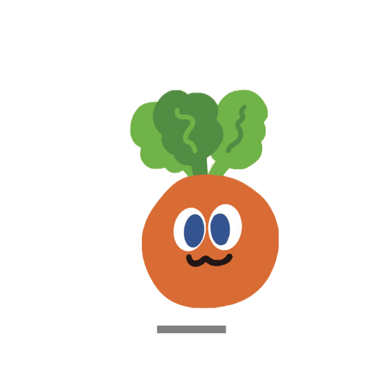 |
| UserPromptSubmit | thinking | Thought bubble | 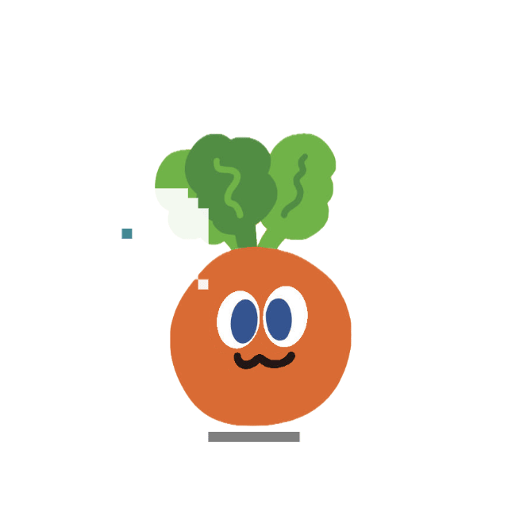 |
| PreToolUse / PostToolUse | working (typing) | Typing |  |
| PreToolUse (3+ sessions) | working (building) | Building | 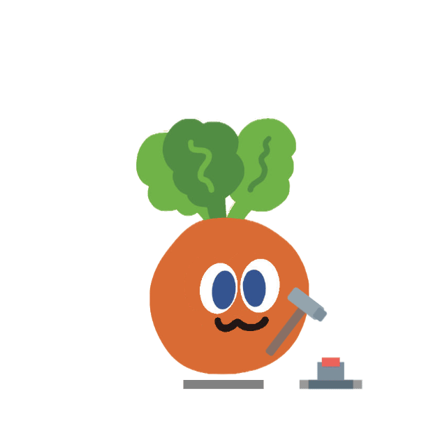 |
| SubagentStart (1) | juggling | Juggling |  |
| SubagentStart (2+) | conducting | Ultrathink-style orchestration |  |
| PostToolUseFailure / StopFailure | error | ERROR + smoke | 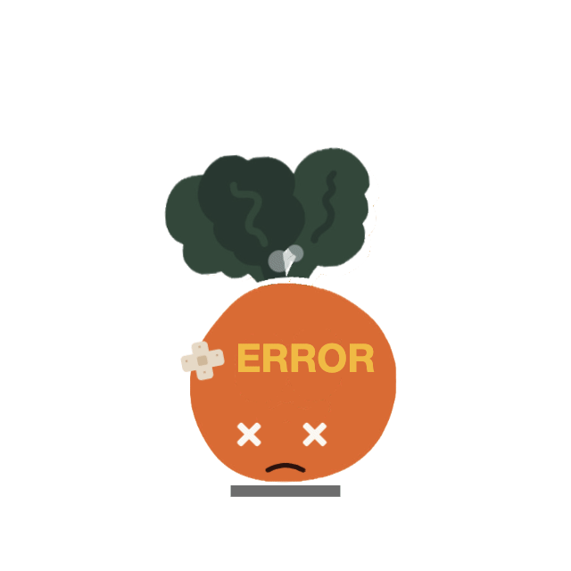 |
| Stop / PostCompact | attention | Happy bounce |  |
| PermissionRequest / Notification | notification | Alert jump |  |
| PreCompact | sweeping | Broom sweep |  |
| WorktreeCreate | carrying | Fruit convoy run-by | 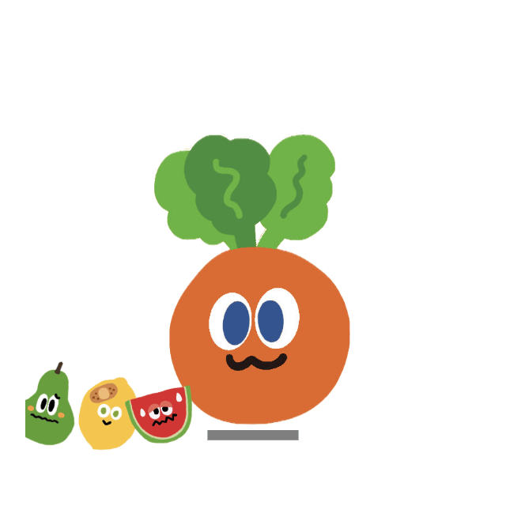 |
| 60s no events | sleeping | Sleep sequence | 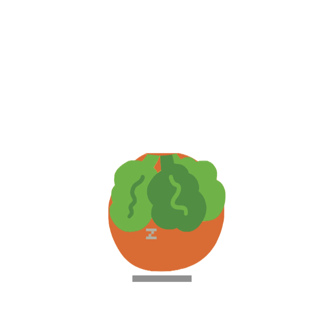 |

### Mini Mode

Drag Mojocarrot to the right screen edge (or right-click → "Mini Mode") to enter mini mode. Mojocarrot hides behind the screen edge with half-body visible, peeking out when you hover.

| Trigger | Mini Reaction | |
|---|---|---|
| Default | Breathing + blinking + eye tracking | 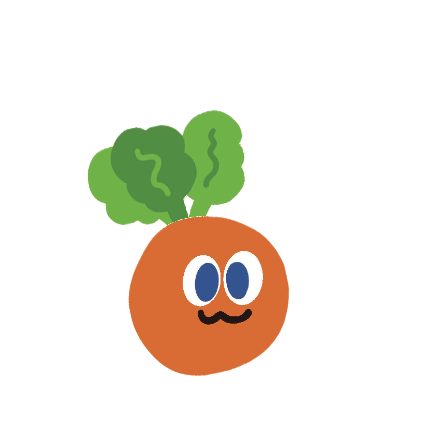 |
| Hover | Peek out from the screen edge |  |
| Notification / PermissionRequest | Exclamation mark pop + >< squint eyes | 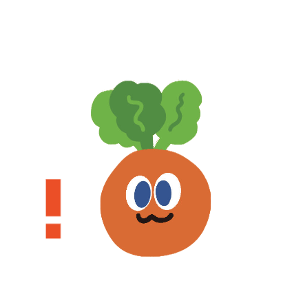 |
| Stop / PostCompact | Sparkler celebration |  |
| Click during peek | Exit mini mode (parabolic jump back) | |

### Click Reactions

Current Mojocarrot reactions are face-zone based:

| Trigger | Reaction | Preview |
|---|---|---|
| Tap left half of the face | `react-left` directional glance | 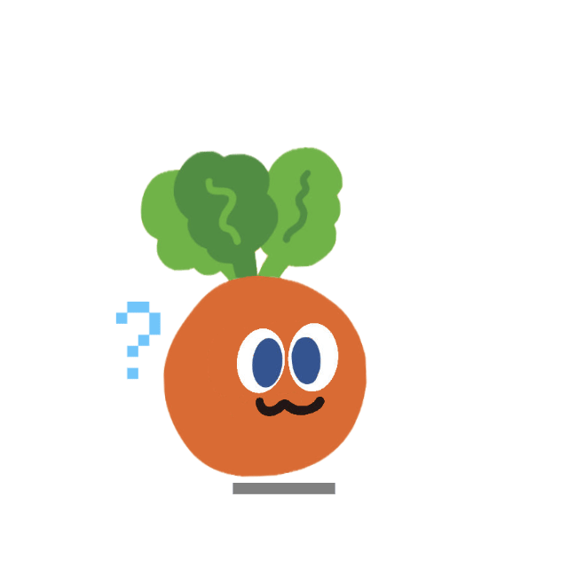 |
| Tap right half of the face | `react-right` directional glance | 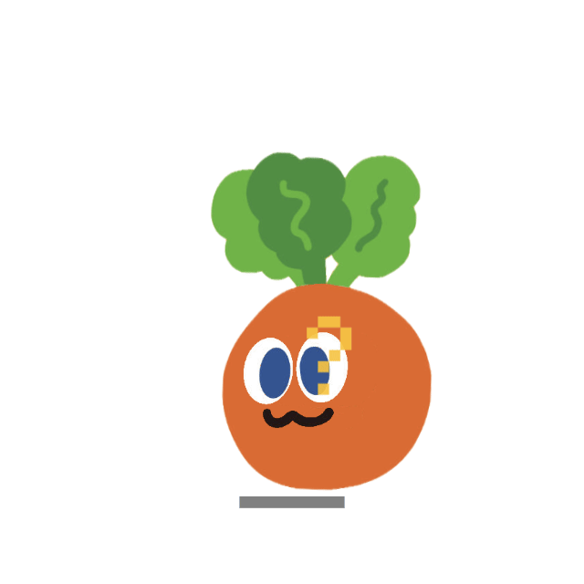 |
| Repeated taps | `react-annoyed` panic-style annoyed reaction | 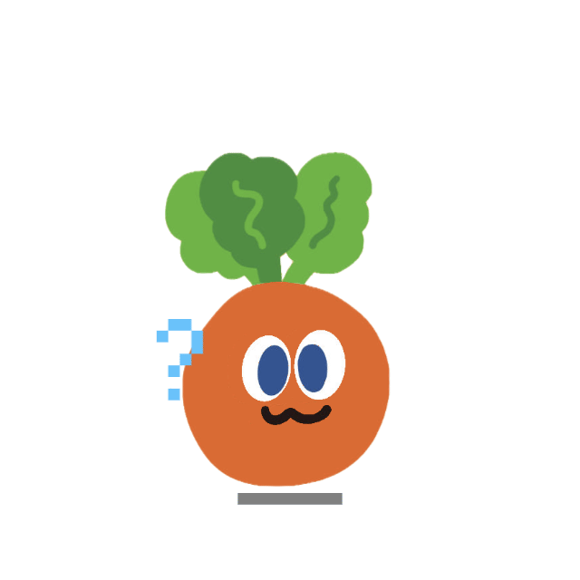 |
| Rapid 4-clicks | `react-double` fruit convoy run-by | 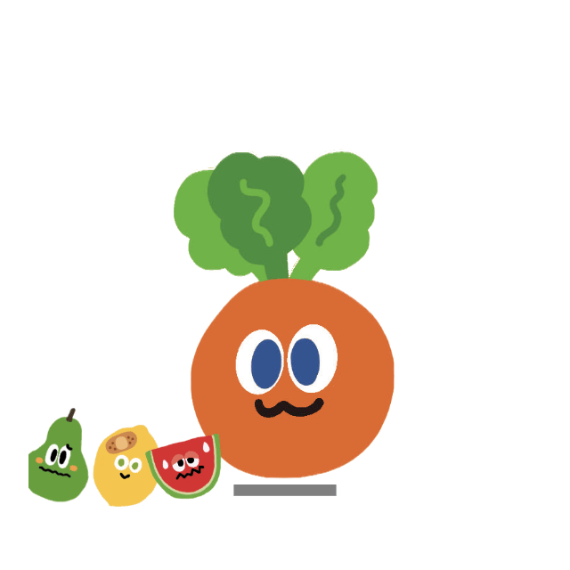 |
| Rapid 4-clicks | `react-double-jump` startled jump |  |
| Rapid 4-clicks | `react-wizard` apple transformation |  |
| Drag the pet | `react-drag` full-body sway |  |

## Quick Start

```bash
# Clone the repo
git clone https://github.com/Puki-li/mojocarrot-on-desk-improved.git
cd mojocarrot-on-desk-improved

# Install dependencies
npm install

# Start Mojocarrot on Desk (auto-registers Claude Code hooks on launch)
npm start
```

For a fresh local install, this repository can now be treated as a standalone Mojocarrot project. You do not need to install the upstream `clawd-on-desk` repository first.

### Agent Setup

**Claude Code** — works out of the box. Hooks are auto-registered on launch. Versioned hooks (`PreCompact`, `PostCompact`, `StopFailure`) are registered only when the app can positively detect a compatible Claude Code version; if detection fails (common for packaged macOS launches), it falls back to core hooks and removes stale incompatible versioned hooks automatically.

**Codex CLI** — works out of the box. Mojocarrot on Desk reads `~/.codex/sessions/` locally: one asynchronous startup recovery scan, then incremental log checks at roughly 1.5-second intervals. Activity and weekly quota data stay local and do not require OpenAI credentials.

**Gemini CLI** — hooks are registered automatically on launch, or manually with `npm run install:gemini-hooks`.

**Cursor Agent** — hooks are registered automatically on launch, or manually with `npm run install:cursor-hooks`.

**Copilot CLI** — requires manually creating `~/.copilot/hooks/hooks.json`; see the limitations below for current permission support.

### Remote SSH (Claude Code & Codex CLI)


Mojocarrot on Desk can sense AI agent activity on remote servers via SSH reverse port forwarding. Hook events and permission requests travel through the SSH tunnel back to your local app — no code changes needed on the desktop side.

**One-click deploy:**

```bash
bash scripts/remote-deploy.sh user@remote-host
```

This copies hook files to the remote server, registers Claude Code hooks in remote mode, and prints SSH configuration instructions.

**SSH configuration** (add to your local `~/.ssh/config`):

```
Host my-server
    HostName remote-host
    User user
    RemoteForward 127.0.0.1:23333 127.0.0.1:23333
    ServerAliveInterval 30
    ServerAliveCountMax 3
```

**How it works:**
- **Claude Code** — command hooks on the remote server POST state changes to `localhost:23333`, which the SSH tunnel forwards back to your local Mojocarrot on Desk instance. Permission bubbles work too — the HTTP round-trip goes through the tunnel.
- **Codex CLI** — a standalone log monitor (`codex-remote-monitor.js`) polls JSONL files on the remote server and POSTs state changes through the same tunnel. Start it on the remote: `node ~/.claude/hooks/codex-remote-monitor.js --port 23333`

Remote hooks run in `CLAWD_REMOTE` mode which skips PID collection (remote PIDs are meaningless locally). Terminal focus is not available for remote sessions.

State and permission POSTs are authenticated. For remote use, provision the value from the local `~/.clawd/auth-token` as `CLAWD_AUTH_TOKEN` in the trusted remote shell before registering hooks or starting the Codex monitor. The token is intentionally not printed or copied automatically by the deploy script.

> Thanks to [@Magic-Bytes](https://github.com/Magic-Bytes) for the original SSH tunneling idea ([#9](https://github.com/rullerzhou-afk/clawd-on-desk/issues/9)).

### macOS Notes

- **From source** (`npm start`): works out of the box on Intel and Apple Silicon.
- **DMG installer**: the app is not signed with an Apple Developer certificate, so macOS Gatekeeper will block it. To open:
  - Right-click the app → **Open** → click **Open** in the dialog, or
  - Run `xattr -cr /Applications/Mojocarrot\ on\ Desk.app` in Terminal.

### Linux Notes

- **From source** (`npm start`): `--no-sandbox` is passed automatically to work around chrome-sandbox SUID requirements in dev mode.
- **Packages**: AppImage and `.deb` are available from [GitHub Releases](https://github.com/Puki-li/mojocarrot-on-desk-improved/releases). After deb install, the app icon appears in GNOME's app menu.
- **Terminal focus**: uses `wmctrl` or `xdotool` (whichever is available). Install one for session terminal jumping to work: `sudo apt install wmctrl` or `sudo apt install xdotool`.
- **Auto-update**: not available on Linux — download new versions manually from GitHub Releases.

## Known Limitations

| Limitation | Details |
|---|---|
| **Codex CLI: no terminal focus** | Codex sessions use JSONL log polling which doesn't carry terminal PID info. Clicking Mojocarrot won't jump to the Codex terminal. Claude Code and Copilot CLI work fine. |
| **Codex CLI: Windows hooks disabled** | Codex hardcodes hooks off on Windows, so we poll log files instead. This means ~1.5s latency vs near-instant for hook-based agents. |
| **Copilot CLI: manual hook setup** | Copilot hooks require manually creating `~/.copilot/hooks/hooks.json`. Claude Code and Codex work out of the box. |
| **Copilot CLI: no permission bubble** | Copilot's `preToolUse` hook only supports deny, not the full allow/deny flow. Permission bubbles only work with Claude Code. |
| **macOS/Linux auto-update** | No Apple code signing on macOS, no auto-update on Linux — download updates manually from GitHub Releases. |
| **Electron window behavior still needs manual testing** | Unit tests cover agents, log polling, and key state-machine behavior; transparent windows, tray integration, and cross-platform focus still require manual verification. |

## Acknowledgments

This project is derived from the public repository [rullerzhou-afk/clawd-on-desk](https://github.com/rullerzhou-afk/clawd-on-desk). Full credit for the original project, concept, and base implementation goes to its original author and contributors.

The Mojocarrot character and related brand identity belong to [STAYREAL](https://tw.istayreal.com/). This repository is an unofficial, non-commercial fan project created for the WMLS community, and is not affiliated with, endorsed by, or operated by STAYREAL.

## License

The code in this repository continues to follow the upstream MIT license from `clawd-on-desk`.

Character rights, trademarks, and other brand assets related to Mojocarrot remain the property of STAYREAL and are not transferred by the MIT license. This fan project is shared for non-commercial use only.
